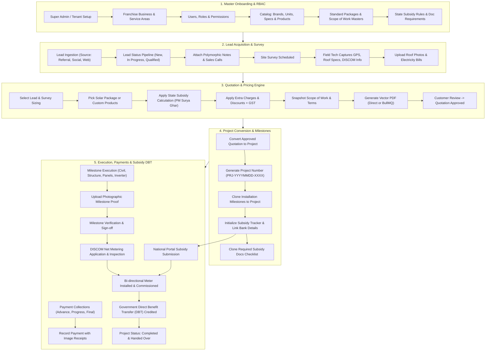
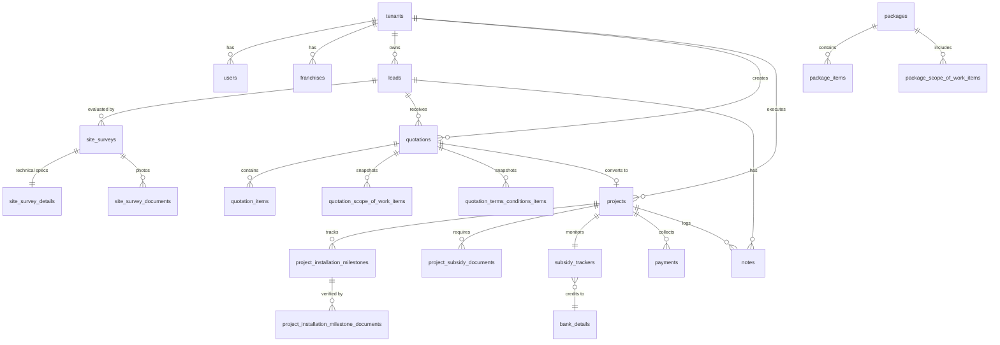

# SunSelect Solar India CRM — Complete Project Flow, Architecture & Deep-Dive Blueprint

> **Notice for AI Models / Developers:**  
> This document is the single source of truth for the **SunSelect Solar India CRM** backend codebase. It details the complete business domain, technical architecture, end-to-end entity flows, database models, API standards, and modular implementation across all 29 modules. When extending or querying this codebase, strictly follow the patterns and architectural invariants described herein.

---

## 1. Project Overview & Business Domain

**SunSelect Solar India CRM** is an enterprise-grade, multi-tenant SaaS CRM platform engineered specifically for the Indian solar EPC (Engineering, Procurement, Construction) and residential/commercial solar installation industry.

### Core Domain Specifics
- **Indian Solar Ecosystem Alignment:** Designed for national and state-level subsidy schemes (e.g., **PM Surya Ghar: Muft Bijli Yojana**, PM-KUSUM, state-specific DISCOM subsidies).
- **DISCOM & Net Metering Workflows:** Manages electricity distribution company (DISCOM) consumer numbers, sanctioned loads, meter installation, test reports, and bidirectional net-meter synchronization.
- **Direct Benefit Transfer (DBT):** Integrates customer bank details and Aadhaar/PAN master records for national portal subsidy disbursements directly into the customer's account.
- **Multi-Tenant & Franchise Distribution Model:** Built with strict tenant data isolation supporting franchise owners, branch offices, and regional service areas.

---

## 2. Technology Stack & Architectural Patterns

### Backend Stack
- **Runtime & Language:** Node.js (ES Modules, `"type": "module"`), TypeScript (Strict Mode).
- **Framework:** Express.js 5.x.
- **Database:** PostgreSQL with raw parameterized SQL via `pg` connection pools (Repository Pattern). No heavy ORMs.
- **Cache & Message Broker:** Redis (`ioredis`), BullMQ for background job queuing.
- **Object Storage:** Cloudflare R2 (S3-compatible via `@aws-sdk/client-s3`) for documents, site survey photos, milestone proof, and quotation PDFs.
- **Document Generation:** Headless Chromium via Puppeteer for high-precision, multi-page vector PDF quotation generation.
- **Logging:** Winston logger (`@packages/logger`). **Zero `console.log()` allowed.**
- **Validation:** Zod schemas for all request payloads.
- **API Documentation:** Swagger / OpenAPI via `@asteasolutions/zod-to-openapi` and `swagger-ui-express`.

### Monorepo Structure (`apps/` & `packages/`)
```
sunselect-crm/
├── apps/
│   └── api/
│       └── src/
│           ├── config/              # App config & environment bindings
│           ├── middlewares/         # Auth, RBAC, error handling, rate limiting
│           ├── modules/             # 29 Domain Feature Modules
│           ├── routes/              # Central route registration (index.ts)
│           ├── types/               # Global TypeScript typings
│           ├── utils/               # Common helpers & formatters
│           ├── app.ts               # Express application configuration
│           └── server.ts            # Server entry point & graceful shutdown
├── packages/
│   ├── common/                      # Shared types, response helpers & error utilities
│   ├── config/                      # Core environment schema & validations
│   ├── connection.ts                # Master PostgreSQL pool export
│   ├── database/                    # Migrations, schema definitions & seeders
│   ├── logger/                      # Winston logger configuration
│   ├── mail/                        # Email service (Nodemailer)
│   ├── queues/                      # BullMQ queues & worker definitions
│   ├── redis/                       # Redis client singleton & connection state
│   └── storage/                     # Cloudflare R2 / S3 storage wrapper
├── docs/                            # Project documentation & blueprints
├── package.json
└── tsconfig.json
```

---

## 3. Strict Coding Conventions & Architectural Invariants

Every module adheres to the **Repository-Service-Controller** layered architecture.

```
Incoming Request
      │
      ▼
Controller (Validates schema via Zod, extracts auth context, invokes service, formats response)
      │
      ▼
Service (Enforces business rules, transactions, calculations, workflows, audit logs)
      │
      ▼
Repository (Executes parameterized PostgreSQL SQL queries, maps rows to entities)
      │
      ▼
Database (PostgreSQL)
```

### Invariant Rules
1. **Zero Business Logic in Controllers:** Controllers only validate requests, invoke services, and return responses.
2. **Zero SQL in Services/Controllers:** SQL queries strictly reside within `*.repository.ts` files.
3. **Response Structure Envelopes:**
   - **Success:**
     ```json
     {
       "success": true,
       "message": "Operation completed successfully",
       "data": {}
     }
     ```
   - **Paginated Response:**
     ```json
     {
       "success": true,
       "message": "Records fetched successfully",
       "data": [ ... ],
       "meta": {
         "total": 120,
         "page": 1,
         "limit": 10,
         "totalPages": 12
       }
     }
     ```
   - **Error Response:**
     ```json
     {
       "success": false,
       "message": "Validation or operational error message",
       "errors": []
     }
     ```
4. **API Pagination Rule:**
   - **Always use `POST /list`** for paginated queries (e.g. `POST /api/v1/leads/list`). `page`, `limit`, `search`, and filters are sent in the JSON request body.
   - **Use `GET /all`** strictly for unpaginated dropdown/lookup data. The returned array must be placed directly inside `"data": [...]` without object nesting.
5. **Soft Delete Rule:**
   - Tables contain `deleted_at TIMESTAMP WITH TIME ZONE DEFAULT NULL`.
   - `POST /list` and `GET /all` accept an optional `status` filter: `"active"` (default), `"deleted"`, or `"all"`.
   - Dedicated restoration endpoint: `PUT /:uid/restore`.
   - DTOs expose an `isDeleted: boolean` computed flag.
6. **Fault-Tolerant Strategy Pattern (Redis & BullMQ Fallback):**
   - High-load background tasks (PDF generation, notifications, email) use BullMQ as primary.
   - If Redis is unavailable or offline, the system automatically switches to the synchronous Direct Fallback strategy without throwing errors to end users.

---

## 4. Complete End-to-End Business Flow Diagram

The following diagram illustrates the complete lifecycle of a customer deal from lead generation to post-installation subsidy credit:



---

## 5. Detailed Step-by-Step Flow Walkthrough

### Stage 1: Tenant, Franchise & Access Control Setup
1. **Multi-Tenancy:** Every operational table contains `tenant_uid`. Tenant isolation is enforced at both service and repository layers.
2. **Franchises (`franchises`):** Tenants create regional franchises with business details, owner details, GSTIN, service pin codes/cities, and required franchise documents (PAN, Aadhaar, Trade License).
3. **RBAC & Menus (`roles`, `menus`, `role-permissions`, `user-permissions`):** Granular permission checks (`can_view`, `can_create`, `can_edit`, `can_delete`, `can_setting`, `can_sale`). Users inherit role permissions with user-specific override capabilities.

### Stage 2: Lead Acquisition & Pipeline
1. **Lead Creation (`leads`):** Captured with consumer contact info, address, electricity bill consumer number, sanction load, roof type, estimated budget, and system size (kW).
2. **Source & Status Tracking (`lead-sources`, `lead-statuses`):** Configurable pipeline stages (e.g. New -> Contacted -> Survey Required -> Quotation Sent -> Closed Won / Lost).
3. **Polymorphic Notes (`notes`):** Sales reps record follow-ups and interaction history mounted dynamically at `/leads/:moduleUid/notes`.

### Stage 3: Site Survey & Technical Feasibility
1. **Site Survey (`site-surveys`):** Triggered directly from a lead. Captures precise GPS latitude/longitude, DISCOM provider, consumer tariff category, and surveyor assignments.
2. **Technical Details (`site_survey_details`):** Stores roof dimensions, shadow obstruction points, structure type (elevated, tin shed, RCC), cable length requirements, earthing pit locations, and inverter placement.
3. **Survey Documents (`site_survey_documents`):** Field technicians upload electricity bill photos, rooftop panoramas, meter board images, and distribution panel photos to Cloudflare R2.

### Stage 4: Product Catalog, Packages & Master Rules
1. **Component Catalog (`products`):** Solar panels (Mono PERC, TOPCon, Bifacial), inverters (String, Micro, Hybrid), mounting structures, ACDB/DCDB boxes, lightning arresters, and cables organized under categories, brands, specifications, and units.
2. **Turnkey Packages (`packages`):** Pre-configured standard offerings (e.g. "3 kW On-Grid Residential Premium Package") bundling panels, inverters, structures, balance of system (BOS), and scope of work items.
3. **State Subsidy Rules (`state-subsidy-rules`):** Central (MNRE PM Surya Ghar) and State-specific financial subsidy formulas (slab-based subsidies: 1 kW to 3 kW = max ₹78,000, etc.), paired with required compliance document templates (`subsidy_required_documents`).

### Stage 5: Quotation Generation & Pricing Engine
1. **Creation (`quotations`):** Links to the lead, specifies system capacity in kW, chooses either a turnkey package or custom bill of materials (BOM).
2. **Sequential Quote Numbering:** Generated using database row locking for thread safety (`QT-YYYYMMDD0001`).
3. **Calculations:**
   - Base Package / Product Total
   - Extra charges (civil work, high-rise mounting, liaisoning fees)
   - Commercial discounts
   - Applicable GST (standard 5% or 12% solar component splits or 18% services)
   - Calculated Subsidy Amount (MNRE + State DBT estimate)
   - Customer Net Payable Amount
4. **Snapshotting:** Scope of work and Terms & Conditions are deep-copied into dedicated quotation sub-tables to preserve an immutable contract copy.
5. **PDF Generation (`QuotationPdfGenerator`):**
   - High-fidelity vector PDF generated via Puppeteer.
   - Uploaded to Cloudflare R2; permanent signed/public URL stored in PostgreSQL.
   - Direct execution fallback if BullMQ queue workers or Redis are offline.

### Stage 6: Project Conversion & Initialization
1. **Conversion (`projects`):** Once a quotation is approved (`status: 2`), it is converted into an active Solar Project (`status: 4` on quote).
2. **Project ID Generation:** Formatted as `PRJ-YYYYMMDD-XXXX`.
3. **Automated Sub-Resource Cloning:**
   - Clones default installation milestones from master table into `project_installation_milestones`.
   - Clones required subsidy documents into `project_subsidy_documents`.
   - Automatically initializes a linked `subsidy_trackers` record with the customer's bank details for DBT.

### Stage 7: Installation Milestones & Field Verification
1. **Milestones (`project_installation_milestones`):** Track sequential stages:
   - Milestone 1: Site Preparation & Civil Foundations
   - Milestone 2: Structure Erection & Panel Mounting
   - Milestone 3: Inverter & Electrical Cabling (AC/DC)
   - Milestone 4: Earthing & Lightning Arrester Installation
   - Milestone 5: Net Meter Application & DISCOM Inspection
   - Milestone 6: Commissioning & Handover
2. **Proof of Work (`project_installation_milestone_documents`):** Engineers upload geo-tagged photos and safety compliance sign-offs before a milestone can be marked completed.

### Stage 8: Payments & Invoicing
1. **Payment Records (`payments`):** Tracks financial transactions against projects and quotations.
2. **Supported Modes:** NEFT, RTGS, IMPS, UPI, Cheque, Cash.
3. **Audit & Verification:** Records transaction/UTR numbers, payment dates, bank account credits, and uploaded receipt images (`image_proof_url`).
4. **Ledger Balance:** Real-time calculation of total contract value, paid amount, and outstanding receivables.

### Stage 9: Subsidy Tracking & DISCOM Commissioning
1. **Subsidy Tracker (`subsidy_trackers`):** Monitors the complete government liaison lifecycle:
   - National Portal application reference number
   - DISCOM feasibility application & approval
   - Work completion report submission
   - Joint inspection by DISCOM engineer
   - Bi-directional net meter release & meter testing
   - Direct Benefit Transfer (DBT) release confirmation & credit amount
2. **Customer Bank Verification (`bank-details`):** Stores customer bank account number, IFSC code, bank branch, and cancelled cheque copy to ensure subsidy credits do not bounce.

### Stage 10: Governance, Audit & Cross-Cutting Operations
1. **Audit Logs (`audit-logs`):** Automatically captures every critical mutation (entity, record UID, action, old/new diff, actor UID, client IP, user agent).
2. **Polymorphic Notes (`notes`):** Unified note/activity log service reusable across Leads, Surveys, Quotations, Projects, and Subsidy Trackers.
3. **Master Documents (`master-documents`):** Manages organizational documents, agreements, vendor contracts, and DISCOM policy circulars.

---

## 6. Directory of All 29 Backend Modules

| # | Module Directory (`apps/api/src/modules/`) | Database Tables Involved | Primary Responsibility & Endpoints |
|---|---|---|---|
| 1 | `auth` | `users`, `user_sessions`, `otps` | Login, JWT access/refresh token rotation, password reset, OTP verification |
| 2 | `users` | `users`, `user_roles` | User lifecycle, team assignments, owner flags (`is_owner`), profile management |
| 3 | `roles` | `roles` | Role definition (Admin, Sales Rep, Surveyor, Project Manager), `can_sale` flag |
| 4 | `role-permissions` | `role_menu_permissions`, `role_feature_permissions` | Menu and action permissions assigned to roles |
| 5 | `user-permissions` | `user_menu_permissions`, `user_feature_permissions` | Individual user permission overrides |
| 6 | `menus` | `menus`, `features` | Dynamic system navigation hierarchy and registered feature actions |
| 7 | `franchises` | `franchise_owner_details`, `franchise_business_details`, `franchise_service_areas`, `franchise_documents` | Franchise onboarding, GSTIN, owner KYC, operational pin codes/cities |
| 8 | `leads` | `leads`, `lead_sources`, `lead_statuses` | CRM sales pipeline, lead assignment, lead status changes, consumer numbers |
| 9 | `site-surveys` | `site_surveys`, `site_survey_details`, `site_survey_documents` | Rooftop engineering audits, shadow analysis, electrical specs, roof photos |
| 10 | `product-categories` | `product_categories` | Solar components taxonomy (Panels, Inverters, Structures, Cables) |
| 11 | `product-brands` | `product_brands` | Manufacturer master (Tata Solar, Waaree, Adani, Growatt, Sungrow) |
| 12 | `product-units` | `product_units` | Measurement units (Watt, kW, Nos, Meters, Sets) |
| 13 | `product-specifications` | `product_specifications` | Technical attributes (Wattage, Efficiency, Phase, Voltage) |
| 14 | `products` | `products`, `product_documents` | Inventory catalog, base rates, warranty periods, technical datasheets |
| 15 | `packages` | `packages`, `package_items`, `package_scope_of_work_items` | Turnkey solar package bundles with predefined component quantities & GST |
| 16 | `state-subsidy-rules` | `state_subsidy_rules`, `subsidy_required_documents` | Central/State subsidy slabs, eligible capacity limits, required document templates |
| 17 | `quotation-scope-of-work` | `quotation_scope_of_work` | Standard scope of work library for EPC contracts |
| 18 | `quotation-terms-conditions` | `quotation_terms_conditions` | Standard commercial terms, payment schedules, and warranty clauses |
| 19 | `quotations` | `quotations`, `quotation_items`, `quotation_scope_of_work_items`, `quotation_terms_conditions_items` | Quotation builder, sequential number generator, tax/discount engine, vector PDF renderer |
| 20 | `projects` | `projects`, `project_statuses`, `project_installation_milestones`, `project_subsidy_documents` | Project execution, milestone checklists, document verification, status lifecycle |
| 21 | `installation-milestones` | `installation_milestones` | Master milestone stages copied to projects upon conversion |
| 22 | `payments` | `payments` | Milestone/advance payments, receipt uploads, transaction verification |
| 23 | `bank-details` | `bank_details` | Bank accounts for customer DBT subsidies and franchise payouts |
| 24 | `subsidy-trackers` | `subsidy_trackers` | End-to-end tracking of DISCOM net meter & National Portal subsidy disbursement |
| 25 | `notes` | `notes` | Polymorphic comments and timeline activity logs across any parent entity |
| 26 | `master-documents` | `master_documents`, `master_document_types` | Tenant-wide document repository and policy records |
| 27 | `locations` | `states`, `districts`, `cities` | Indian geographical postal and administrative hierarchy |
| 28 | `audit-logs` | `audit_logs` | Immutable security and operational audit trail |
| 29 | `notification` | `notification_logs` | Centralized notification dispatch (Email, SMS, WhatsApp) with BullMQ / Direct fallback |

---

## 7. Key Database Tables & Entity Relationships



---

## 8. Developer Quick Reference: How to Extend Features

When adding or updating endpoints, strictly follow this recipe:

1. **Database Migration:** Add a new SQL file in `packages/database/migrations/` using `snake_case` table and column names.
2. **DTO & Interface (`dto/`, `interfaces/`):** Define TypeScript interfaces. Export a `toSafeEntity()` transformation function to strip internal IDs and passwords.
3. **Validator (`validators/`):** Write Zod schemas for `create`, `update`, and `paginationSchema`.
4. **Repository (`repositories/`):** Write raw SQL using parameterized queries (`$1, $2`). Handle `deleted_at IS NULL` for active queries.
5. **Service (`services/`):** Implement business logic, transactions (`BEGIN/COMMIT/ROLLBACK`), error throwing (`throw new CustomError(message, statusCode)`), and Winston logging.
6. **Controller (`controllers/`):** Extract validated request body/params, call the service, and respond via `res.status(code).json({ success: true, message, data, meta })`.
7. **Routes (`routes/`):** Register endpoints adhering to:
   - `POST /list` for pagination
   - `GET /all` for dropdown arrays
   - `GET /:uid` for single entity
   - `POST /` for creation
   - `PUT /:uid` for updates
   - `DELETE /:uid` for soft delete
   - `PUT /:uid/restore` for recovery
8. **Mount in `apps/api/src/routes/index.ts`**.
